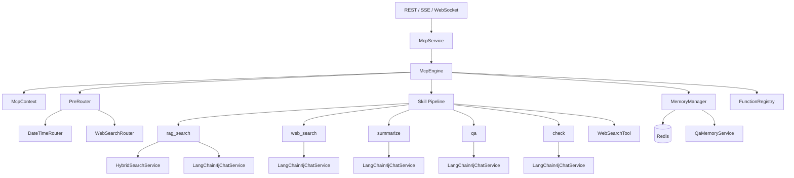
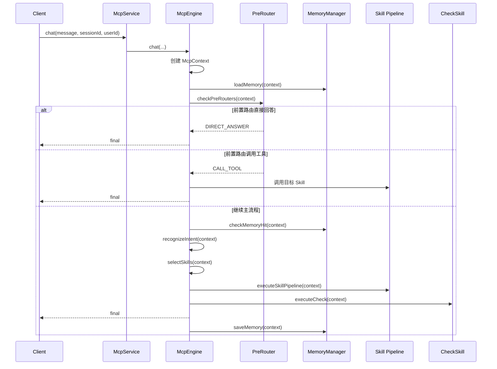

# MCP 模块说明文档

更新时间：2026-06-08

## 1. 模块定位

`src/main/java/com/yizhaoqi/smartpai/mcp` 是 SmartPai 项目中的 Agent 控制平面模块，用来统一编排用户消息、会话上下文、记忆检索、前置路由、工具调用、RAG 检索、联网搜索、回答生成和质量检查。

这里的 MCP 更接近项目内部的“模型上下文与工具编排协议”，不是一个独立对外暴露的标准 MCP Server。它的核心目标是把不同 AI 能力抽象成可插拔的 `Skill`，再由 `McpEngine` 根据上下文和意图进行调度。

模块主要解决以下问题：

- 统一维护一轮对话的上下文状态。
- 在进入 RAG 前快速处理日期、实时信息等简单或外部工具问题。
- 将知识库检索、联网搜索、通用问答、摘要、质检抽象成插件式能力。
- 通过 `Flux<McpEvent>` 对外提供流式事件，方便前端展示执行过程。
- 为后续 Function Calling 或 LLM 自主选工具预留函数注册能力。

## 2. 目录结构

```text
mcp/
├── context/       # MCP 上下文与状态枚举
├── core/          # 核心执行引擎 McpEngine
├── event/         # 对外流式事件 McpEvent
├── function/      # Function Calling 函数定义与注册中心
├── memory/        # Redis 会话记忆与问答缓存
├── router/        # 前置路由接口、路由结果、路由实现
├── service/       # MCP 服务门面
└── skill/         # 技能接口、参数、结果、事件与技能实现
```

## 3. 总体架构



外部接入点不在 `mcp` 包内，但会调用本模块：

| 入口 | 位置 | 说明 |
|------|------|------|
| REST / SSE | `controller/McpController.java` | `/api/mcp/chat`、`/api/mcp/chat/stream`、`/api/mcp/session/{sessionId}` |
| MCP WebSocket | `handler/McpWebSocketHandler.java` | WebSocket 路径 `/ws/mcp` |
| Agent WebSocket | `handler/MultiAgentWebSocketHandler.java` | WebSocket 路径 `/ws/agent-chat`，底层调用 `McpService` |

## 4. 核心执行流程

`McpEngine.chat(message, sessionId, userId)` 是主入口，返回 `Flux<McpEvent>`。执行过程在线程池 `mcpTaskExecutor` 中异步完成，默认整体超时时间为 60 秒。



主流程阶段如下：

| 阶段 | 状态 | 主要职责 |
|------|------|----------|
| 0. 前置路由 | 未写入 `McpState` | 日期时间、实时搜索等问题优先处理，可能直接返回或调用工具 |
| 1. 记忆检索 | `MEMORY_RETRIEVAL` | 通过 `QaMemoryService.findSimilarAnswer` 查询相似历史问答 |
| 2. 意图识别 | `INTENT_RECOGNITION` | 使用规则识别 `SEARCH`、`COMPARE`、`SUMMARIZE`、`QA`、`CHAT` |
| 3. 技能选择 | `SKILL_SELECTION` | 根据意图和 `Skill.shouldInvoke` 选择技能 |
| 4. 技能执行 | `RAG_RETRIEVAL` | 执行 RAG、联网搜索、摘要、问答等技能 |
| 5. 质量检查 | `QUALITY_CHECK` | 调用 `check` 技能对最终回答评分 |
| 6. 最终回复 | `COMPLETED` | 发送 `final` 事件 |
| 7. 保存记忆 | `COMPLETED` 前后 | 保存会话历史和已通过质检的问答缓存 |

## 5. 核心类说明

| 类 | 包 | 职责 |
|----|----|------|
| `McpEngine` | `mcp.core` | MCP 控制平面核心，负责任务调度、状态流转、路由处理、技能流水线、质检、事件发送 |
| `McpService` | `mcp.service` | 服务门面，向 Controller 和 WebSocket Handler 提供同步与流式对话接口 |
| `McpContext` | `mcp.context` | 单轮对话上下文，承载会话、历史、意图、技能结果、最终回复、来源、状态和功能开关 |
| `McpState` | `mcp.context` | MCP 执行状态枚举 |
| `McpEvent` | `mcp.event` | 对外流式事件模型，用于 SSE / WebSocket 推送 |
| `MemoryManager` | `mcp.memory` | 加载和保存 Redis 会话记忆，管理问答缓存 |
| `PreRouter` | `mcp.router` | 前置路由接口，用于在主 RAG 流程前快速处理特殊问题 |
| `RouteResult` | `mcp.router` | 前置路由结果，支持直接回答、调用工具、继续流程、请求更多信息 |
| `Skill` | `mcp.skill` | 所有能力插件的统一接口 |
| `SkillParams` | `mcp.skill` | 技能运行时参数容器 |
| `SkillResult` | `mcp.skill` | 技能统一返回结果 |
| `SkillEvent` | `mcp.skill` | 技能内部流式事件，执行时会转换为 `McpEvent` |
| `SkillParameterSchema` | `mcp.skill` | 技能参数 JSON Schema 定义，用于 Function Calling |
| `FunctionRegistry` | `mcp.function` | 将启用的 `Skill` 注册成 OpenAI Function Calling 风格的函数定义 |

## 6. McpContext 上下文模型

`McpContext` 是整个 MCP 流程中的共享状态对象，可以理解为一轮对话的“运行现场”。

| 字段类型 | 关键字段 | 说明 |
|----------|----------|------|
| 会话信息 | `sessionId`、`userId`、`userMessage`、`timestamp` | 标识当前请求和用户 |
| 多轮上下文 | `chatHistory`、`memory` | 历史对话和 Redis 上下文变量 |
| 意图识别 | `intent`、`confidence`、`keywords` | 当前消息的意图结果 |
| 技能结果 | `calledSkills`、`skillResults`、`finalReply`、`sources` | 已执行技能、缓存结果、最终回答和引用来源 |
| 状态管理 | `state`、`needWebSearch`、`checkPassed`、`checkScore`、`retryCount`、`errorMessage` | 流程状态、联网搜索标记、质检和错误信息 |
| 功能开关 | `streamingEnabled`、`webSearchEnabled`、`checkEnabled`、`memoryEnabled` | 控制是否启用流式、联网搜索、质检和记忆 |

常用辅助方法：

- `addChatMessage(role, content)`：添加历史消息。
- `addCalledSkill(skillName)`：记录已调用技能。
- `putSkillResult(key, value)`：缓存技能结果或流程标记。
- `getSkillResult(key)`：读取技能结果。
- `addSource(source)`：添加来源信息。
- `getRecentHistory(n)`：获取最近 n 条历史消息。

## 7. 事件协议

`McpEvent` 是对外推送的事件模型，主要用于 SSE 和 WebSocket。

| 事件类型 | 常量 | 含义 |
|----------|------|------|
| `start` | `TYPE_START` | 阶段或技能开始。当前 `McpEvent.state(...)` 也会发出 `start` 类型 |
| `complete` | `TYPE_COMPLETE` | 阶段或技能完成 |
| `stream` | `TYPE_CHUNK` | 流式文本片段 |
| `final` | `TYPE_FINAL` | 最终回答，`data` 中携带来源信息 |
| `error` | `TYPE_ERROR` | 错误事件 |
| `state` | `TYPE_STATE` | 常量已定义，但当前工厂方法未直接使用该类型 |

最终回复事件结构大致如下：

```json
{
  "type": "final",
  "agent": "system",
  "message": "最终回答内容",
  "data": [
    {
      "id": "文档ID_分块ID",
      "fileName": "文件名",
      "content": "来源摘要",
      "score": 0.87
    }
  ],
  "sessionId": "mcp_xxx",
  "timestamp": 1710000000000
}
```

## 8. 技能清单

### 8.1 rag_search

| 项 | 内容 |
|----|------|
| 类 | `skill.impl.RagSkill` |
| 名称 | `rag_search` |
| 类别 | `RETRIEVAL` |
| 优先级 | `10` |
| 是否支持流式 | 是 |
| 依赖 | `HybridSearchService`、`LangChain4jChatService` |
| 触发意图 | `SEARCH`、`QA`、`COMPARE`、`SUMMARIZE`、`CHAT` |

职责：

- 使用 `HybridSearchService.searchWithPermission(query, userId, topK)` 在本地知识库中按权限检索。
- 将检索结果拼接成参考上下文。
- 调用 `LangChain4jChatService.chat(systemPrompt, prompt)` 生成回答。
- 返回 `reply`、`sources`、`usedLLM`、`resultCount`。
- 检索无结果时写入 `context.skillResults["rag_failed"] = true`，用于触发联网搜索 fallback。

返回数据示例：

```json
{
  "reply": "基于文档生成的回答",
  "sources": [
    {
      "id": "fileMd5_chunkId",
      "fileName": "xxx.pdf",
      "content": "文档片段摘要",
      "score": 0.91
    }
  ],
  "usedLLM": true,
  "resultCount": 5
}
```

### 8.2 web_search

| 项 | 内容 |
|----|------|
| 类 | `skill.impl.SearchSkill` |
| 名称 | `web_search` |
| 类别 | `RETRIEVAL` |
| 优先级 | `20` |
| 是否支持流式 | 是 |
| 依赖 | `LangChain4jChatService` |
| 触发条件 | `needWebSearch=true`、`rag_failed=true` 或最终回答为空 |

职责：

- 当本地 RAG 无结果或需要实时信息时执行联网搜索。
- 当前 `performWebSearch` 是模拟实现，返回 `https://example.com/result/{i}` 形式的示例数据。
- 再用 LLM 对搜索结果进行总结，返回 `reply`、`sources`、`usedWebSearch`。

相关配置：

- `ai.web-search.enabled`，默认 `true`。
- `ai.web-search.api-key`，默认空。
- `ai.web-search.engine`，默认 `bing`。

### 8.3 summarize

| 项 | 内容 |
|----|------|
| 类 | `skill.impl.SummarySkill` |
| 名称 | `summarize` |
| 类别 | `GENERATION` |
| 优先级 | `30` |
| 是否支持流式 | 否 |
| 依赖 | `LangChain4jChatService` |
| 触发意图 | `SUMMARIZE` |

职责：

- 对输入文本进行摘要。
- 支持摘要风格 `brief`、`detailed`、`bullet`。
- 默认最大长度为 500 字。
- 如果参数没有传入 `text`，会尝试从 `context.skillResults["sources"]` 读取来源内容。

返回数据：

```json
{
  "summary": "摘要内容",
  "style": "brief",
  "originalLength": 1234
}
```

### 8.4 qa

| 项 | 内容 |
|----|------|
| 类 | `skill.impl.QaSkill` |
| 名称 | `qa` |
| 类别 | `GENERATION` |
| 优先级 | `50` |
| 是否支持流式 | 是 |
| 依赖 | `LangChain4jChatService` |
| 触发意图 | `QA`、`CHAT`、`UNKNOWN` |

职责：

- 直接调用 LLM 进行通用问答、闲聊、知识推理。
- 会拼接最近 5 条历史消息作为提示词上下文。
- 系统提示词为“你是派聪明知识助手，请用简体中文回答问题。”

### 8.5 check

| 项 | 内容 |
|----|------|
| 类 | `skill.impl.CheckSkill` |
| 名称 | `check` |
| 类别 | `VALIDATION` |
| 优先级 | `5` |
| 是否支持流式 | 否 |
| 依赖 | `LangChain4jChatService` |
| 调用方式 | 由 `McpEngine.executeCheck` 在最终回答生成后调用 |

职责：

- 对回答进行快速规则检查，例如长度上下限。
- 调用 LLM 进行深度质量评估，要求返回 JSON。
- 检查维度包括相关性、准确性、完整性、可读性。
- 分数达到 `pass-score-threshold` 才通过，默认阈值为 6 分。
- 如果质检异常，当前实现默认通过，避免因为质检服务异常阻断回答。

返回数据：

```json
{
  "passed": true,
  "score": 7,
  "reason": "回答相关且基本完整"
}
```

### 8.6 WebSearchTool

| 项 | 内容 |
|----|------|
| 类 | `skill.impl.WebSearchSkill` |
| 名称 | `WebSearchTool` |
| 类别 | `TOOL` |
| 优先级 | `10` |
| 是否支持流式 | 否 |
| 调用方式 | 由 `WebSearchRouter` 前置路由直接调用 |

职责：

- 给前置路由提供“实时搜索工具”能力。
- 当前也是模拟实现，文档中应视为待接入真实搜索 API 的占位工具。
- 可接入 Google Custom Search API、Bing Web Search API、SerpAPI 或 DuckDuckGo Instant Answer API。

## 9. 前置路由

前置路由在主流程前执行，适合处理不需要知识库检索的问题。所有 `PreRouter` 通过 Spring `@Component` 自动注册，`McpEngine.init()` 中按 `getOrder()` 从小到大排序。

### 9.1 DateTimeRouter

| 项 | 内容 |
|----|------|
| 类 | `router.impl.DateTimeRouter` |
| 名称 | `DateTimeRouter` |
| 优先级 | `10` |
| 路由结果 | `DIRECT_ANSWER` |

支持问题示例：

- 今天是周几。
- 今天几号。
- 现在几点。
- 今年是哪一年。
- 距离春节、元旦、国庆、中秋、端午还有多少天。

注意事项：

- 日期时间使用 `LocalDateTime.now()` 和 `LocalDate.now()`。
- 农历节日日期当前是简化近似处理，不适合对农历日期要求严格的业务场景。

### 9.2 WebSearchRouter

| 项 | 内容 |
|----|------|
| 类 | `router.impl.WebSearchRouter` |
| 名称 | `WebSearchRouter` |
| 优先级 | `20` |
| 路由结果 | `CALL_TOOL`，目标工具为 `WebSearchTool` |

触发关键词包括：

- 搜索、查找、查询、查一下、帮我查。
- 最新、最近、今天、实时。
- 新闻、消息、资讯。
- 天气、股价、汇率、油价。

路由命中后会提取搜索关键词，构造参数：

```json
{
  "query": "搜索关键词",
  "limit": 5
}
```

## 10. Function Calling 注册

`FunctionRegistry` 会在 `McpEngine.init()` 阶段注册所有启用的 `Skill`：

```java
for (Skill skill : skills) {
    if (skill.isEnabled()) {
        functionRegistry.registerSkill(skill);
    }
}
```

注册内容包括：

- 函数名称：`skill.getName()`。
- 函数描述：`skill.getDescription()`。
- 参数定义：`skill.getParameterSchema()`。
- Skill 映射：函数名到具体 `Skill` 实例。

`FunctionRegistry.getOpenAiFunctionDefinitions()` 可输出 OpenAI Function Calling 风格定义。当前主流程主要靠规则意图识别、前置路由和 `Skill.shouldInvoke` 选技能，Function Calling 注册中心更像是后续扩展 LLM 自主选工具的基础设施。

## 11. 记忆管理

`MemoryManager` 负责两类记忆：

| 类型 | Redis Key | TTL | 说明 |
|------|-----------|-----|------|
| 会话历史 | `mcp:history:{sessionId}` | 24 小时 | 保存 `role`、`content`、`timestamp` |
| 上下文变量 | `mcp:memory:{sessionId}` | 当前代码只加载，未统一写入 | 保存任意上下文变量 |
| 问答缓存 | `mcp:qa_cache:{userId}:{question.hashCode()}` | 7 天 | 保存问题、答案、意图、时间戳 |

主流程中的记忆命中不是直接用 Redis 精确 key，而是调用：

```java
qaMemoryService.findSimilarAnswer(context.getUserMessage(), context.getUserId(), null)
```

命中后会直接设置：

- `context.finalReply = memory.answer`
- `context.skillResults["cacheHit"] = true`
- `context.skillResults["originalQuestion"] = memory.question`
- `context.skillResults["accessCount"] = memory.accessCount`

保存问答缓存的条件是：

- `context.finalReply != null`
- `context.checkPassed == true`

## 12. 对外接口

### 12.1 SSE 流式接口

```http
GET /api/mcp/chat/stream?message=问题&sessionId=会话ID&userId=用户ID
```

返回：

```text
text/event-stream
```

事件对象为 `McpEvent`。

### 12.2 同步接口

```http
POST /api/mcp/chat
Content-Type: application/json

{
  "message": "问题",
  "sessionId": "可选",
  "userId": "可选"
}
```

返回字段：

| 字段 | 说明 |
|------|------|
| `success` | 是否生成了最终回复 |
| `reply` | 最终回答 |
| `sources` | 来源列表 |
| `calledSkills` | 已调用技能列表 |
| `checkPassed` | 是否通过质检 |
| `sessionId` | 会话 ID |

### 12.3 会话状态接口

```http
GET /api/mcp/session/{sessionId}
```

返回当前活跃会话的 `McpContext`。注意：`activeSessions` 会在流结束后移除，所以该接口更适合查看正在执行中的会话状态。

### 12.4 WebSocket 接口

| 路径 | Handler | 说明 |
|------|---------|------|
| `/ws/mcp` | `McpWebSocketHandler` | MCP 企业级 AI Agent 平台入口 |
| `/ws/agent-chat` | `MultiAgentWebSocketHandler` | 多 Agent 聊天入口，底层调用 `McpService` |

WebSocket 请求体示例：

```json
{
  "message": "帮我查一下今天的天气",
  "userId": "u001"
}
```

## 13. 相关配置

当前代码支持的 MCP 相关配置项：

| 配置项 | 默认值 | 说明 |
|--------|--------|------|
| `mcp.router.enabled` | `true` | 是否启用前置路由总开关 |
| `mcp.router.routers.DateTimeRouter` | `true` | 是否启用日期时间路由 |
| `mcp.router.routers.WebSearchRouter` | `true` | 是否启用实时搜索路由 |
| `ai.web-search.enabled` | `true` | 是否启用 `web_search` 技能 |
| `ai.web-search.api-key` | 空 | 预留搜索 API Key |
| `ai.web-search.engine` | `bing` | 预留搜索引擎选择 |
| `ai.prompt.rules` | 空 | RAG 生成回答时的系统提示词 |
| `ai.generation.temperature` | `0.3` | 生成温度 |
| `ai.generation.max-tokens` | `2000` | 生成最大 token 数 |
| `ai.agent.check.source-marker` | `【` | 质检时识别来源标记 |
| `ai.agent.check.min-reply-length` | `10` | 回答最小长度 |
| `ai.agent.check.max-reply-length` | `2000` | 回答最大长度 |
| `ai.agent.check.pass-score-threshold` | `6` | 质检通过分数 |

`application.yml` 中目前已有 `ai.generation` 和 `ai.agent.check` 配置。`mcp.router` 如果未显式配置，`RouterProperties` 会默认启用所有路由。

可选配置示例：

```yaml
mcp:
  router:
    enabled: true
    routers:
      DateTimeRouter: true
      WebSearchRouter: true

ai:
  web-search:
    enabled: true
    api-key: ""
    engine: bing
  generation:
    temperature: 0.3
    max-tokens: 2000
  agent:
    check:
      source-marker: "【"
      min-reply-length: 10
      max-reply-length: 2000
      pass-score-threshold: 6
```

线程池配置在 `config/AsyncConfig.java`：

| Bean | 核心线程 | 最大线程 | 队列 | 说明 |
|------|----------|----------|------|------|
| `mcpTaskExecutor` | 5 | 20 | 100 | MCP 对话流程执行线程池 |
| `taskExecutor` | 5 | 15 | 50 | 默认异步任务线程池 |

## 14. 如何新增一个 Skill

新增技能通常只需要实现 `Skill` 并标注 `@Component`。

步骤：

1. 在 `mcp/skill/impl` 下新增类，例如 `CalculatorSkill`。
2. 实现 `getName()`，名称必须唯一。
3. 实现 `getDescription()`，用于日志、工具说明和 Function Calling 描述。
4. 实现 `getParameterSchema()`，定义参数。
5. 实现 `execute(context, params)`。
6. 如需流式输出，重写 `supportsStreaming()` 和 `executeStream()`。
7. 实现 `shouldInvoke(context)`，控制何时被主流程选中。
8. 返回结果中如果要成为最终回复，建议包含 `reply` 字段；如果有引用，建议包含 `sources` 字段。

示例骨架：

```java
@Component
public class CalculatorSkill implements Skill {

    @Override
    public String getName() {
        return "calculator";
    }

    @Override
    public String getDescription() {
        return "执行基础数学计算";
    }

    @Override
    public SkillParameterSchema getParameterSchema() {
        return SkillParameterSchema.create()
                .property("expression", SkillParameterSchema.PropertySchema.string("数学表达式").required(true))
                .required("expression");
    }

    @Override
    public SkillResult execute(McpContext context, SkillParams params) {
        String expression = params.getString("expression");
        Map<String, Object> data = new LinkedHashMap<>();
        data.put("reply", "计算结果：...");
        data.put("expression", expression);
        return SkillResult.success(data, "计算完成");
    }

    @Override
    public boolean shouldInvoke(McpContext context) {
        return context.getUserMessage() != null && context.getUserMessage().contains("计算");
    }
}
```

如果技能走流式执行，需要在 `executeStream()` 中发出 `SkillEvent.result(SkillResult.success(data))`，否则 `McpEngine` 收集事件时可能拿不到最终 `SkillResult`。

## 15. 如何新增一个 PreRouter

新增前置路由适合处理明确、规则性强、不需要进入 RAG 的请求。

步骤：

1. 在 `mcp/router/impl` 下新增类并实现 `PreRouter`。
2. 标注 `@Component`，让 Spring 自动注册。
3. 实现 `matches(context)` 判断是否命中。
4. 实现 `route(context)` 返回 `RouteResult`。
5. 用 `getOrder()` 设置优先级，数值越小越先执行。
6. 在 `application.yml` 的 `mcp.router.routers` 中按类名开关控制。

返回类型选择：

| 返回类型 | 使用场景 |
|----------|----------|
| `DIRECT_ANSWER` | 可以直接计算或直接回答，例如日期时间 |
| `CALL_TOOL` | 需要调用某个工具技能，例如搜索、计算器、天气 |
| `CONTINUE` | 不处理，继续主流程 |
| `NEED_MORE_INFO` | 信息不足，需要用户补充 |

配置示例：

```yaml
mcp:
  router:
    routers:
      CalculatorRouter: true
```

## 16. 当前实现注意事项

- `SearchSkill` 和 `WebSearchSkill` 当前都还是模拟搜索实现，没有真正调用外部搜索 API。
- `WebSearchRouter` 会把实时信息问题路由到 `WebSearchTool`，而 RAG fallback 使用的是 `web_search`，两者是不同技能。
- `McpEvent.state(...)` 当前发送的事件类型是 `start`，不是 `state`。如果前端按事件类型区分阶段，需要以当前实现为准。
- `QaSkill.executeStream()` 当前只发送 `CHUNK` 和 `COMPLETE`，没有发送 `RESULT`。在 `McpEngine` 的流式技能收集逻辑中，只有 `RESULT` 会被转换成 `SkillResult`。
- `SummarySkill` 返回字段是 `summary`，而 `McpEngine.handleRagResult` 只专门处理 RAG 的 `reply` 和 `sources`。如果摘要结果要直接成为最终回答，需要在引擎中增加对应结果处理，或让摘要技能返回并被统一处理为 `reply`。
- `DateTimeRouter` 对春节、中秋、端午等农历节日使用近似日期，生产环境建议接入正式日历服务。
- `MemoryManager.saveMemory()` 保存的是 `context.chatHistory`。当前引擎流程中需要确保本轮用户消息和助手回答被加入 `chatHistory`，否则历史对话不会持续累积。
- `FunctionRegistry` 已准备好 Function Calling 定义，但当前 MCP 主流程尚未让 LLM 基于函数定义自主选择工具。

## 17. 小结

这个 MCP 模块可以看作 SmartPai 的一套轻量 Agent 编排框架。它的优势是结构清晰、插件化程度高、扩展 `Skill` 和 `PreRouter` 比较直接，并且已经接入流式事件、Redis 记忆、RAG 检索和回答质检。

当前最值得优先完善的方向是：

1. 接入真实联网搜索 API，替换模拟搜索。
2. 统一各技能返回结构，让非 RAG 技能也能稳定写入 `finalReply`。
3. 补齐流式技能的 `RESULT` 事件，保证引擎能拿到最终结果。
4. 完善多轮记忆写入，确保每轮用户消息和助手回复都进入 `chatHistory`。
5. 将 `FunctionRegistry` 真正接入 LLM Function Calling，让模型可以自主选择工具。
