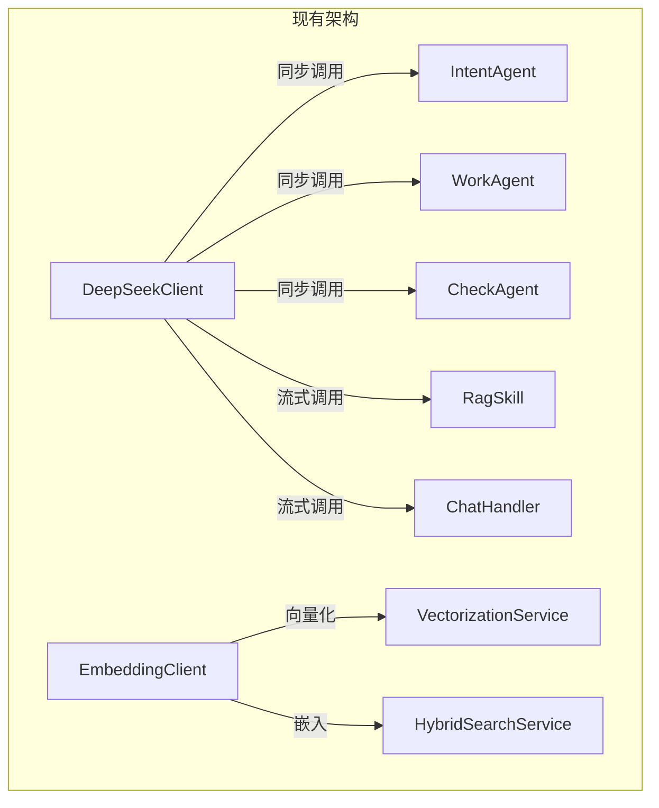
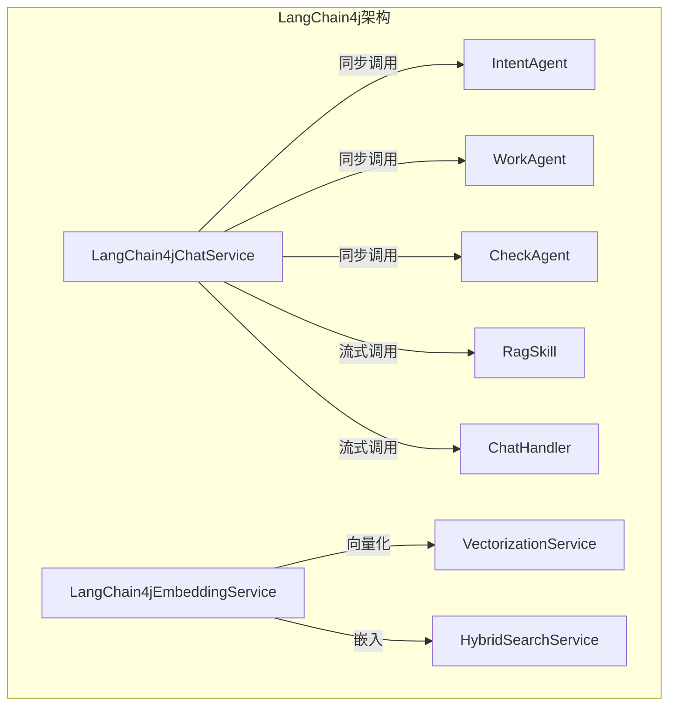
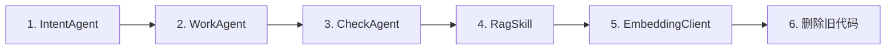

# LangChain4j 集成计划

## 1. 概述

本文档描述如何将已创建的 LangChain4j 服务类直接替换现有业务流程中的自定义 HTTP 客户端，实现从 DeepSeekClient/EmbeddingClient 到 LangChain4j 框架的直接迁移。

## 2. 架构变更

### 2.1 变更前



### 2.2 变更后



## 3. 迁移顺序



## 4. 详细迁移步骤

### 4.1 步骤一：替换 IntentAgent

**修改 IntentAgent.java：**

将 `DeepSeekClient` 替换为 `LangChain4jAgentService`：

```java
@Component
public class IntentAgent {
    private final LangChain4jAgentService langChain4jAgentService;
    private final ObjectMapper objectMapper;
    private final AiProperties aiProperties;
    
    public IntentAgent(LangChain4jAgentService langChain4jAgentService,
                       ObjectMapper objectMapper,
                       AiProperties aiProperties) {
        this.langChain4jAgentService = langChain4jAgentService;
        this.objectMapper = objectMapper;
        this.aiProperties = aiProperties;
    }
    
    public AgentIntent analyze(String message, String sessionId) {
        // 使用 LangChain4j 进行意图识别
        LangChain4jAgentService.IntentResult result =
            langChain4jAgentService.recognizeIntent(message);
        return convertToAgentIntent(result, message, sessionId);
    }
}
```

### 4.2 步骤二：替换 WorkAgent

**修改 WorkAgent.java：**

将 `DeepSeekClient` 替换为 `LangChain4jChatService`：

```java
@Component
public class WorkAgent {
    private final LangChain4jChatService chatService;
    
    public WorkAgent(LangChain4jChatService chatService) {
        this.chatService = chatService;
    }
    
    public String generate(String systemPrompt, String userMessage,
                          List<Map<String, String>> history) {
        return chatService.chat(systemPrompt, userMessage, history);
    }
}
```

### 4.3 步骤三：替换 CheckAgent

**修改 CheckAgent.java：**

将 `DeepSeekClient` 替换为 `LangChain4jAgentService`：

```java
@Component
public class CheckAgent {
    private final LangChain4jAgentService agentService;
    
    public CheckAgent(LangChain4jAgentService agentService) {
        this.agentService = agentService;
    }
    
    public CheckResult check(String question, String answer) {
        return agentService.checkQuality(question, answer);
    }
}
```

### 4.4 步骤四：替换 RagSkill

**修改 RagSkill.java：**

将 `DeepSeekClient` 替换为 `LangChain4jRagService`：

```java
@Component
public class RagSkill implements Skill {
    private final HybridSearchService searchService;
    private final LangChain4jRagService ragService;
    
    public RagSkill(HybridSearchService searchService,
                    LangChain4jRagService ragService) {
        this.searchService = searchService;
        this.ragService = ragService;
    }
    
    @Override
    public SkillResult execute(McpContext context, SkillParams params) {
        // 使用 LangChain4j RAG 服务
        return ragService.executeRag(context, params);
    }
}
```

### 4.5 步骤五：替换 EmbeddingClient

**修改 VectorizationService.java：**

将 `EmbeddingClient` 替换为 `LangChain4jEmbeddingService`：

```java
@Service
public class VectorizationService {
    private final LangChain4jEmbeddingService embeddingService;
    
    public VectorizationService(LangChain4jEmbeddingService embeddingService) {
        this.embeddingService = embeddingService;
    }
    
    public List<float[]> embed(List<String> texts) {
        return embeddingService.embed(texts);
    }
}
```

### 4.6 步骤六：删除旧代码

删除以下文件：
- `client/DeepSeekClient.java`
- `client/EmbeddingClient.java`

## 5. 配置完善

### 5.1 LangChain4jConfig

确保配置正确读取现有配置：

```java
@Configuration
public class LangChain4jConfig {
    @Value("${deepseek.api.url}")
    private String apiUrl;
    
    @Value("${deepseek.api.key}")
    private String apiKey;
    
    @Value("${deepseek.api.model}")
    private String model;
    // ...
}
```

### 5.2 LangChain4jStoreConfig

使用现有 Elasticsearch 配置：

```java
@Configuration
public class LangChain4jStoreConfig {
    @Value("${elasticsearch.host}")
    private String esHost;
    
    @Value("${elasticsearch.port}")
    private int esPort;
    // ...
}
```

## 6. 测试计划

### 6.1 单元测试

- 测试各 Agent 的意图识别和生成功能
- 测试 EmbeddingService 的向量化功能

### 6.2 集成测试

- 测试完整 RAG 流程
- 测试 Agent 协作流程
- 测试流式响应

## 7. 完成标准

- [ ] IntentAgent 迁移完成
- [ ] WorkAgent 迁移完成
- [ ] CheckAgent 迁移完成
- [ ] RagSkill 迁移完成
- [ ] EmbeddingClient 迁移完成
- [ ] 旧代码删除完成
- [ ] 单元测试通过
- [ ] 集成测试通过

## 8. 文件变更清单

| 操作 | 文件 | 说明 |
|------|------|------|
| 修改 | service/agent/IntentAgent.java | 替换为 LangChain4j |
| 修改 | service/agent/WorkAgent.java | 替换为 LangChain4j |
| 修改 | service/agent/CheckAgent.java | 替换为 LangChain4j |
| 修改 | mcp/skill/impl/RagSkill.java | 替换为 LangChain4j |
| 修改 | service/VectorizationService.java | 替换为 LangChain4j |
| 修改 | service/HybridSearchService.java | 替换为 LangChain4j |
| 删除 | client/DeepSeekClient.java | 移除旧实现 |
| 删除 | client/EmbeddingClient.java | 移除旧实现 |
